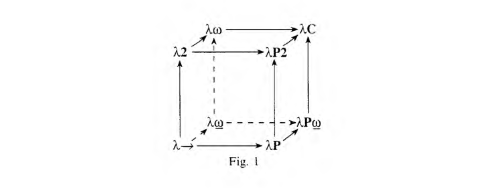

# Correspondence between type theory and holographic reduced representations

From [Barendregt](https://homepages.inf.ed.ac.uk/wadler/papers/barendregt/pure-type-systems.pdf),
our syntax is something like:
```
T, U = x | c | T U | λ (x : T) . U | Π (x : T) . U
```
with `x` being the set of variables, and `c` being the set of constants 
(constructors) of types given in the environment. Following 
[*Hey Pentti*](https://github.com/eilene-ftf/holis/blob/main/heypentti.pdf),
in order for us to make a workable correspondence, we need to map all 
of the operations given by our type theory to operations over the 
vector symbolic architecture. 

This task requires us to first:
1. delimit the functions that are required for us to make our type 
theory work, and,
2. pick out those operations in our vector symbolic architecture 
which would adequately capture the functions in (1).

Barendregt's framing here is helpful. His project allows us to conceptualize
different type systems as being variations on rules.

Our goal is to implement `λC`, or the Calculus of Constructions. It is 
capable of expressing:
> 1. terms depending on terms;
> 2. terms depending on types;
> 3. types depending on terms;
> 4. types depending on types.
